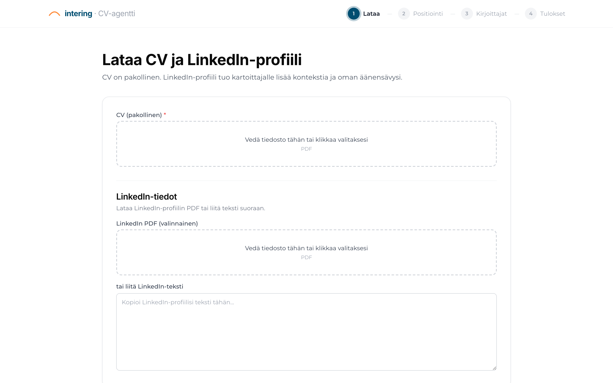
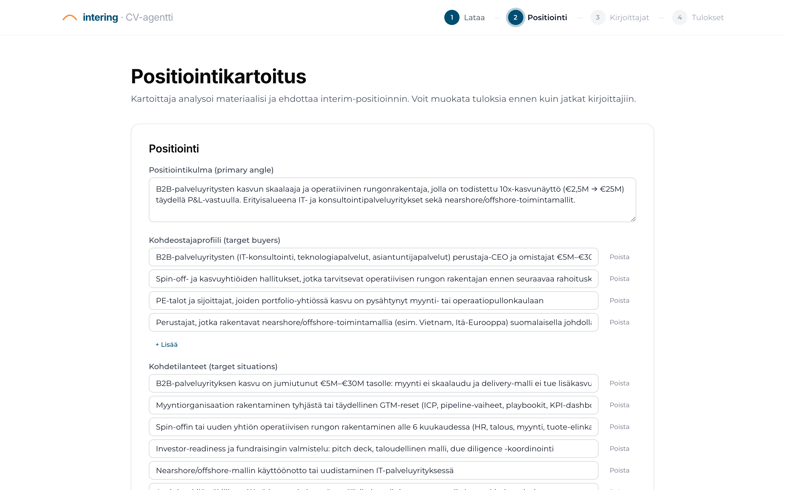
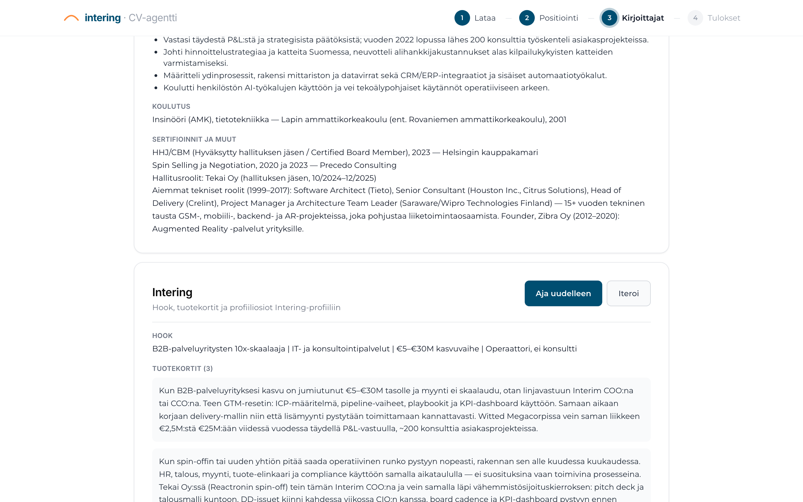
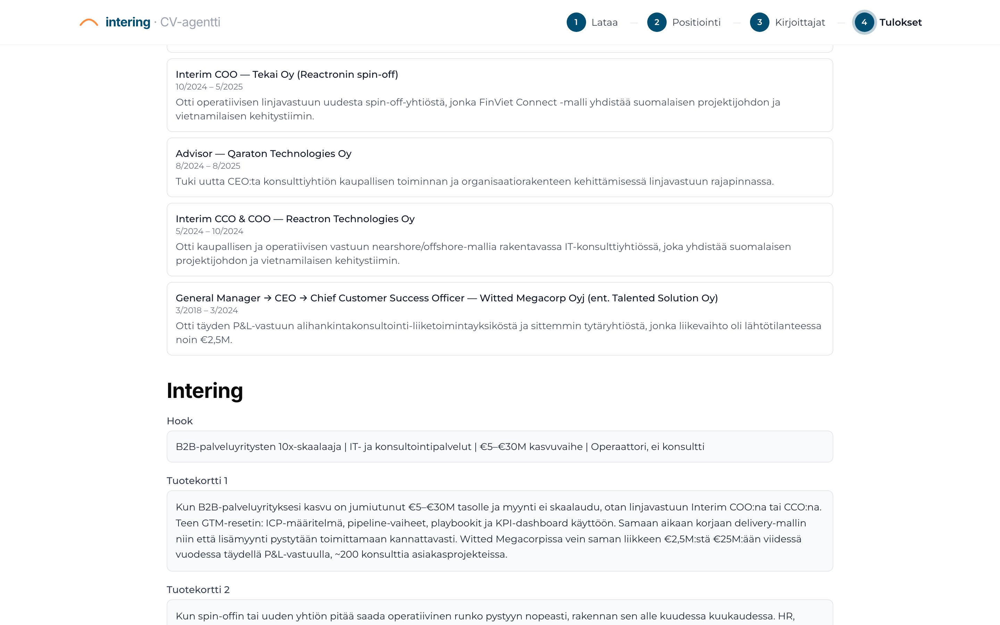

# Intering CV-agentti

**AI-agentti joka kirjoittaa intering-yhteisön jäsenelle myyvemmät LinkedIn-, CV- ja intering.fi-profiilit interim-toimeksiantoja varten.**

Toimittaja: Muuronen Advisory Oy · Versio: vaiheen 2 prototyyppi · Päivitetty 13.5.2026

---

## Miksi tämä on tarpeen

Useimmat jäsenten CV:t ja LinkedIn-profiilit on kirjoitettu vakityönhakuun tai brändäykseen — eivät interim-toimeksiantojen voittamiseen. Interim-ostaja (toimitusjohtaja, hallitus, PE-talo, perheyrityksen omistaja) lukee profiilin 5 sekunnissa ja tekee päätöksen yhden kysymyksen pohjalta: *"Onko tämä ihminen ratkaissut minun tilanteeni ennenkin?"*

Tämä vaatii erilaista positiointia kuin tavanomainen ura-CV:

| Tavallinen CV/LinkedIn | Interim-CV |
|---|---|
| Korostaa pitkää uraa ja tenure-aikoja | Korostaa lyhyitä projekteja ja mitattavia tuloksia |
| Tehtävänimikkeitä, vastuita | Tilanteita, joihin sopii ratkaisijaksi |
| "Kokenut johtaja" -tyyppinen kuvaus | "Operaattori joka teki itse — ei konsultti" |
| Geneerinen "Mitä etsin" | Konkreettinen tilannetyyppi + yrityksen koko + mandaatti |

Jäsenen aikaa kuluu profiilien kirjoittamiseen ja iterointiin. Lopputulos on usein hyvä mutta epätasalaatuinen — sama jäsen voi olla osa-aikaisessa toimeksiannossa unohtanut päivittää profiiliaan ja menettää tilaisuuksia.

---

## Ratkaisu kolmessa vaiheessa

Jäsen lataa CV:nsä ja LinkedIn-profiilinsa, agentti tuottaa kolme valmista lopputuotetta noin 2–4 minuutissa. Jäsen iteroi tarvittaessa ja vie tekstit suoraan LinkedIniin ja intering.fi-profiiliinsa, lataa CV:n PDF:nä.

### 1. Lataa materiaali

CV pakollinen (PDF), LinkedIn-profiili optionaalinen joko PDF-latauksena tai paste-tekstinä.

### 2. Tarkista ja muokkaa positiointia

**Kartoittaja-agentti** analysoi materiaalin ja ehdottaa positiointidokumentin: pääpositiointikulma, kohdeostajaprofiilit, kohdetilanteet, erottautumistekijät, lippulaivasaavutus, avainviestit. Jäsen voi muokata kaikkia kenttiä ennen kuin jatkaa kirjoittajiin.

### 3. Aja kirjoittajat ja iteroi

Kolme erillistä agenttia tuottavat omat lopputuotteensa kartoituksen pohjalta. Jokainen on iteroitavissa erikseen — esim. "kirjoita LinkedIn-About lyhyemmin" tai "korosta nearshore-osaamista".

---

## Konkreettinen näyttö — Janin omasta tuotoksesta

Agentin tuottama positiointi Janin materiaalin pohjalta:

> *"B2B-palveluyritysten kasvun skaalaaja ja operatiivinen rungonrakentaja, jolla on todistettu 10x-kasvunäyttö (€2,5M → €25M) täydellä P&L-vastuulla. Erityisalueena IT- ja konsultointipalveluyritykset sekä nearshore/offshore-toimintamallit."*

**LinkedIn-headline** (165 merkkiä, kova raja 220):

> *"Interim COO/CCO B2B-palveluyrityksille | Skaalasin alihankintaliiketoiminnan €2,5M → €25M täydellä P&L-vastuulla | Operaattori, ei konsultti | Nearshore/offshore-mallit | HHJ"*

**LinkedIn-About-aloituskappale**:

> *"Skaalasin Witted Megacorpissa alihankintakonsultoinnin €2,5M:stä €25M:ään viidessä vuodessa täydellä P&L-vastuulla — kannattavuus säilyttäen, lähes 200 konsulttia asiakasprojekteissa. Sama kaava ei toistu joka yrityksessä, mutta operaattorin ote toistuu."*

**Intering.fi-profiilin hook** (pakollinen pipe-formaatti, 4 osaa):

> *"B2B-palveluyritysten 10x-skaalaaja | IT- ja konsultointipalvelut | €5–€30M kasvuvaihe | Operaattori, ei konsultti"*

**CV:n key_results** (3–5 vahvinta mitattavaa tulosta):

- Skaalasi alihankintakonsultoinnin €2,5M → €25M (10x) viidessä vuodessa kannattavuus säilyttäen — Witted Megacorp 2018–2024, täysi P&L-vastuu
- Kasvatti asiakasprojekteissa työskentelevän konsulttipoolin lähes 200 henkilöön vuoden 2022 loppuun mennessä
- Rakensi spin-offin (Tekai Oy) operatiivisen rungon — HR, talous, myynti, tuote-elinkaari ja compliance — alle 6 kuukaudessa
- Sulki vähemmistösijoituskierroksen DD-issuet 2 viikossa ja toi Tekai Oy:lle vähemmistösijoituksen kotiin
- Tuotti Tekai Oy:lle 3-vuoden kasvuroadmapin, joka hyväksyttiin yksimielisesti hallituksessa

---

## Mikä erottaa interim-CV:n vakityö-CV:stä — säännöt jotka agentti pakottaa

Agentti on rakennettu sisäänrakennettujen sääntöjen varaan, jotka heijastavat sitä mitä suomalaiset interim-ostajat etsivät:

- **Operaattori-framing**: "Skaalasin", "Rakensin", "Vein läpi" — ei "auttoi", "tuki", "osallistui"
- **Mitattavat tulokset etusijalla**: numerot, prosentit, euromäärät, aikamääreet ennen adjektiiveja
- **Kielletyt jargon-sanat**: "synergia", "stakeholder", "leverage", "drive", "kokenut johtaja", "monipuolinen osaaja"
- **Suomi**: kaikki output suomeksi, vakiintuneet englanninkieliset termit (P&L, GTM, ICP, CRM, CEO/COO/CCO) säilyvät
- **Tilannelähtöinen positiointi**: "Tehtävät joihin sovin parhaiten" → konkreettiset tilannetyypit + yrityskoko, ei kompetenssilista
- **Roolien valinta**: agentti pudottaa vanhat tai epärelevantit roolit pois CV:stä — tiivistää ne yhdistelmälauseiksi sertifiointiosioon

Säännöt ovat osa promptteja jotka **intering-vetäjä voi muokata selaimessa ilman koodimuutoksia** kun yhteisö haluaa hienosäätää painotuksia.

---

## Tulokset käyttäjälle

Yhden istunnon päätteeksi jäsen saa:

| Lopputuotos | Käyttö |
|---|---|
| **LinkedIn**: Headline (max 220 merkkiä), About (1500–2000 merkkiä), Experience-osiot mitattavilla bullet-pisteillä | Kopioi suoraan LinkedIniin |
| **CV**: PDF A4-muodossa, Inter-fontilla, mustavalkoinen siisti template | Lataa ja lähetä asiakkaalle |
| **Intering.fi-profiili**: Hook (pipe-formaatti), 2–3 tuotekorttia, 5 profiiliosiota (Kuka olen, Miksi timanttinen interim, jne.) | Kopioi suoraan intering.fi-profiiliin |

---

## Iterointi ja admin-toiminnot

**Jäsen voi iteroida** mitä tahansa tuotosta vapaamuotoisella ohjeella ("kirjoita About lyhyemmin", "korosta nearshore-kokemusta", "tee särmikkäämpi sävy"). Agentti pitää muistissa edelliset versiot ja viimeisen 3 iteraation kontekstin, jotta jokainen pyyntö perustuu aiempaan.

**Intering-vetäjä (admin)** voi muokata kaikkia neljää promptia selaimessa ilman koodimuutoksia. Muokatut versiot tallentuvat erillään git-historiasta, ja "Palauta oletukseen" -painike tuo alkuperäisen takaisin. Tämä mahdollistaa promptin hienosäädön käytön perusteella ilman, että toimittajan (Muuronen Advisory) tarvitsee tehdä jatkuvasti koodimuutoksia.

---

## Tekninen toteutus lyhyesti

- **AI-malli**: Claude Opus 4.7 (Anthropic) kartoittajalle ja kaikille kirjoittajille
- **Kartoittajalla** on "adaptive thinking" päällä — malli käyttää harkinta-aikaa ennen vastausta, mikä tuottaa terävämmän positioinnin
- **Backend**: FastAPI + Pydantic, in-memory sessio (ei tietokantaa)
- **Frontend**: React + Tailwind CSS, brändi intering.fi:n mukainen
- **PDF-renderöinti**: Playwright + Jinja2-template, Inter-fontti paikallisesti
- **Hostaus**: Docker Compose. Vaihe 3:ssa UpCloud Suomi-konesalissa Caddy reverse proxylla.
- **Tietosuoja**: jäsenen materiaalit käsitellään pelkästään muistissa istunnon ajan. Ei tallenneta levylle eikä tietokantaan. Anonyymi käyttötilasto (ajojen lkm, kesto, virheet) säilytetään ilman henkilötietoja.

Lähdekoodi: https://github.com/janimur/intering-cv-agentti

---

## Tilanne nyt vs. vaihe 3 (jäljellä)

**Valmis (vaihe 1 + vaihe 2)**:

- ✓ Agenttilogiikka ja promptit toimivat — testattu Janin omalla profiililla useilla iteraatioilla
- ✓ React-frontend wizard-rakenteella, intering.fi-tyylinen
- ✓ FastAPI-backend, iteraatio sliding window -muistilla
- ✓ Playwright PDF-renderöinti A4-muotoon
- ✓ Admin-käyttöliittymä promptien muokkaukseen
- ✓ Docker Compose -paketti lokaaliksi käyttöön
- ✓ 195 automatisoitua testiä (yksikkö, API, frontend, E2E)
- ✓ Pre-commit hook joka estää rikkinäisen koodin pääsyn historiaan
- ✓ Manuaalitestauksen tarkistuslista (TESTING.md)

**Vaihe 3 jäljellä** (toimitettava intering-yhteisölle):

- Magic link -kirjautuminen (sähköposti) + Google Sheets -jäsenrekisteri
- UpCloud-deployment Suomi-konesaliin (TLS, domain `cv.intering.fi` tai vastaava)
- CI/CD GitHub Actionsista
- Mahdollinen suora API-integraatio intering.fi-profiilin päivitykseen (sopimuksen mukaan, ei välttämätön)

**Aikataulu vaihe 3:lle**: noin 2–3 viikkoa toimittajan työaikaa kun sopimus syntyy.

---

## Demo

Lokaali kontti ajossa. Demo-istunto Janin koneella tai SSH-tunnelilla 1–2 testijäsentä kerrallaan.

**Yhteyshenkilö**: Jani Muuronen / Muuronen Advisory Oy / jani@muuronen.fi
